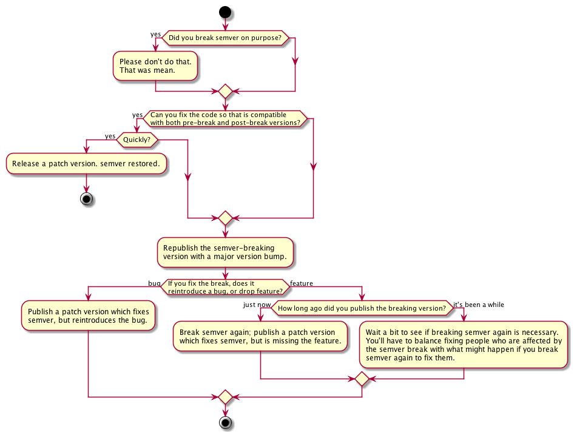

# You broke SemVer. Now what?

**Work in progress, but patches/comments/suggestions welcome.**

It [happens][] [occasionally][]. A maintainer publishes a release of software
which, according to the [rules of semver][semver], _should_ have been a major
version bump. But mistakes were made, and the version of software was published
with only a minor or patch version bump.

 [happens]: https://github.com/chalk/ansi-styles/issues/15
 [occasionally]: https://github.com/chaijs/chai/blob/84ed233a6d5dcc93ca7a759cedbd5fb10d52fabb/ReleaseNotes.md#200--2015-02-09

If you work with a system [which relies on semver][nmp-semver] for any period of
time, you have probably been on the receiving end of one of these breaks. But
what do you do when you are the guilty party?

The SemVer specification is [somewhat less than helpful][semver-break].

 > What if I inadvertently alter the public API in a way that is not compliant
 > with the version number change (i.e. the code incorrectly introduces a major
 > breaking change in a patch release)
 >
 > Use your best judgment. If you have a huge audience that will be drastically
 > impacted by changing the behavior back to what the public API intended, then
 > it may be best to perform a major version release, even though the fix could
 > strictly be considered a patch release. Remember, Semantic Versioning is all
 > about conveying meaning by how the version number changes. If these changes
 > are important to your users, use the version number to inform them.

Unfortunately, people can be a bit panicky when these sorts of things happen,
and do things which on the surface seem like a good idea (like unpublish the
version and pretend it never happened), but turn out to be harmful (because it
really did happen, and someone was already using that version).

The purpose of this document is to help you calmly and methodically figure out
the best course of action to take when you realize that you've broken semver.

 

 [npm-semver]: https://docs.npmjs.com/getting-started/semantic-versioning
 [semver-break]: http://semver.org/#what-if-i-inadvertently-alter-the-public-api-in-a-way-that-is-not-compliant-with-the-version-number-change-ie-the-code-incorrectly-introduces-a-major-breaking-change-in-a-patch-release

 [semver]: http://semver.org/

## Building

The chart is written in [PlantUML](http://plantuml.com/activity2.html). After
updating `flow-chart.plant`, run `make` to rebuild the chart.

## TODO

 * Make the chart prettier
